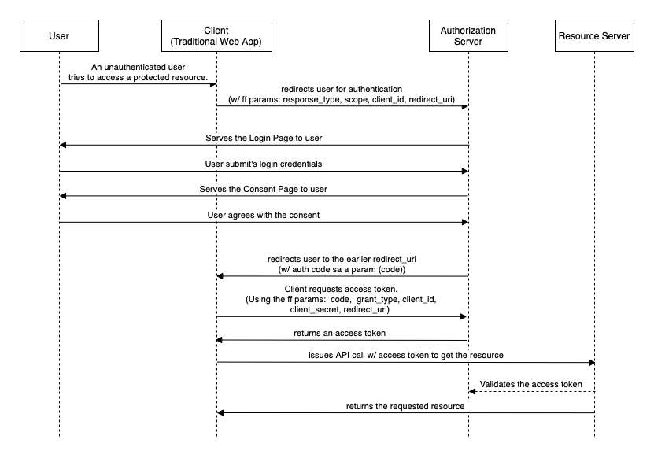

# FLUXOS DE AUTENTICAÇÃO - AUTHORIZATION CODE

  

O authorization code é um fluxo de autenticação muito usado em aplicações webs e mobile, isso porque considerando que os ambientes onde essas aplicações rodam são ambientes "inseguros", é necessário que sejam tomadas medidas para amenizar os riscos.

Algumas características positivas são:

* Isolamento de login: O usuário é redirecionado para uma página fora do site/aplicativo onde ele insere suas credenciais, garantindo assim que as mesmas não sejam conhecidas ou manipuladas pelo site em questão.

* Código de autorização: Quando o usuário insere credenciais válidas na tela de login ele é redirecionado para o sistema que deseja acessar (site ou aplicativo), nesse momento é enviado na url um código de autorização que pode ser trocado posteriormente por um access token.  
O uso desse código faz toda a diferença, pois dessa forma o token de acesso, que é a "chave" usada para acessar o sistema, não fica exposto na url.

Nessa pasta você pode conferir um exemplo da implementação desse fluxo usando apenas nodejs, sem uso de libs.

Antes de iniciarmos a demonstração dos fluxos é necessário realizar a configuração do keycloak, para isso é necessário criar um client, a única configuração que precisa ser mudada é a das urls válidas, de redirecionamento e de origem.
Após a criação do cliente basta realizar a criação de um usuário para teste, em seguida entre no link OpenID Endpoint configuration e procure pelo campo "authorization_endpoint", ele indica qual url você deve usar para realizar a conexão com o keycloak.